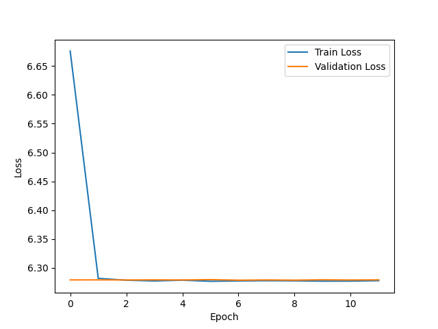

## Building a MovieLens Recommender System Using Neural Collaborative Filtering

This project implements a Neural Collaborative Filtering (NeuCF) model in PyTorch for movie recommendations using the MovieLens dataset.

Key features include:

- Model Architecture: Combines user and item embeddings with fully connected hidden layers to predict user ratings for movies.
- Training & Evaluation: Includes mechanisms for early stopping to prevent overfitting and ensure optimal model performance.
- Recommendations: Provides a function to generate top N movie recommendations for a given user, outputting IMDb links for easy access to movie details.
- Preprocessing: Ensures no user rates the same movie more than once by handling duplicate entries effectively.

The result is an efficient recommendation system that can predict user preferences and suggest movies with direct IMDb links.

We'll be using these packages to do our analysis:

- [pandas](https://pandas.pydata.org/)
- [numpy](https://numpy.org/)
- [pytorch](https://pytorch.org/)
- [matplotlib](https://matplotlib.org/)
- [scikit-learn](https://scikit-learn.org/stable/)

In this repo, you'll find one notebook:

1. [notebook](neucf.ipynb): this contains all the codes
